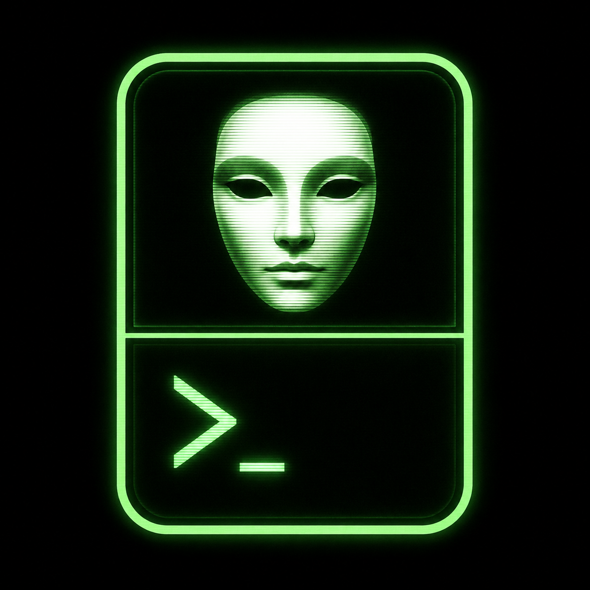

# muxxy



A command-line tool for interacting with a REPL running inside a
[tmux](https://github.com/tmux/tmux) pane — a Rust CLI mirror of the
[`tmux-repl-mcp`](https://github.com/djha-skin/tmux-repl-mcp) MCP server's
tools. Where the MCP server keys off named REPL "kinds", muxxy matches a set
of prompt regexes, so any REPL — Python, Janet, `irb`, Lisp, a shell,
whatever — works as long as you can describe its prompt (or use a built-in
`--kind`).

It talks to tmux through the [`tmux_interface`](https://crates.io/crates/tmux_interface)
Rust crate's typed command builders, and prints **YAML** with multiline output
as literal block scalars — nearly identical to what the REPL printed, and
still machine-consumable.

## Working visibly, or headless

muxxy supports two working styles, and which one you want depends on whether
you are sitting in tmux:

- **Visible** — you're in tmux and want to watch the AI work. The agent
  splits a pane **by default** (or when you say *"I'm in tmux, keep things
  visible"*) and runs the REPL there, in front of your eyes:

  ```bash
  muxxy split-pane --directory ~/Code/proj \
    --command 'cd ~/Code/proj && clrepl' --sleep 8   # pane: "%1"
  muxxy --pane '%1' --kind sbcl execute-command '(foo)'
  muxxy --pane '%1' kill-pane                        # clean up
  ```

- **Headless** — isolated work with nothing on screen. The agent keeps its
  own hidden tmux session and targets it with `--socket`:

  ```bash
  tmux -L mywork new-session -d -s work 'clrepl'
  muxxy --socket /tmp/tmux-1000/mywork --kind sbcl execute-command '(foo)'
  ```

Either way, one invocation talks to exactly one pane (`-t/--pane`); for
"both panes" just invoke twice. Panes are fully isolated from each other.

## Usage

```text
muxxy [OPTIONS] <COMMAND>
```

Point muxxy at a REPL with a `--prompt` regex (repeatable, since a REPL can
have several prompt styles) or a built-in `--kind`. It works with *any* REPL
whose prompt you can describe — Python, Janet, Ruby, shells, Node, and the
Lisp family included:

```bash
# Python — even multi-line blocks (note the continuation prompt)
muxxy --prompt '^>>> ' --prompt '^\.\.\. ' send-keys $'for i in range(3):\n    print(i*10)\n'
muxxy --prompt '^>>> ' --prompt '^\.\.\. ' get-last-command

# Ruby (irb)
muxxy --kind irb execute-command '[1, 2, 3].map { |x| x * 2 }'

# Janet — the kind also includes delimiter-aware continuation prompts
muxxy --kind janet execute-command '(+ 40 2)'

# SBCL
muxxy --kind sbcl execute-command '(+ 40 2)'

# SBCL — commands that error drop into the debugger, and you keep going there
muxxy --kind sbcl execute-command '(error "boom")'
muxxy --kind sbcl execute-command '1'   # choose the printed top-level restart
```

The SBCL debugger prompt (`0]`, `ldb> `) is just another prompt as far as
muxxy is concerned — a valid command boundary, so you can keep typing at it.
And if your REPL isn't in the built-in `--kind` table, one or two `--prompt`
regexes are all it takes:

```bash
muxxy --prompt '^myrepl> ' execute-command 'something'
```

Janet's default prompt is `repl:1:> ` (the number advances with input). While
an expression is incomplete, Janet shows the parser's open-delimiter state,
for example `repl:5:(> ` for an unfinished parenthesized form. The built-in
`janet` kind covers both prompt styles.

Custom prompt patterns should be anchored to the prompt prefix and must cover
all styles the REPL can show (for example, both SBCL's `* ` and `0]` debugger
prompts). muxxy warns when a custom pattern also matches ordinary output such
as `1024`, since that can make output look like a prompt and drop it.

## Commands

### `is-repl-ready`

Check whether the pane is showing a bare prompt (i.e. the REPL is idle and
ready for input). Idle means *bare*: an echoed command line like
`>>> time.sleep(5)` starts with the prompt but the REPL is busy, so it is not
reported ready.

```bash
muxxy --prompt '^>>> ' is-repl-ready
```

```yaml
kind: "^>>> "
is_ready: true
```

`kind` is the matching `--kind` name when one was used, otherwise the matching
prompt regex; `null` when the pane is busy or unrecognised.

### `get-last-command`

Look back through the pane history for a complete prompt → command → output →
prompt block and return the last command and its output. Both fields are
`null` when no complete block is found.

```bash
muxxy --prompt '^>>> ' get-last-command
```

```yaml
last_command: 2 + 3
output: "5"
```

### `execute-command`

Send a command to the REPL and wait — polling the pane, never guessing at
`sleep` durations — until the REPL is idle again, then return the output:

```bash
muxxy --prompt '^>>> ' execute-command '[print(i) for i in range(3)]' --check 0.1
```

```yaml
status: ok
last_command: "[print(i) for i in range(3)]"
output: |-
  0
  1
  2
  [None, None, None, None]
```

Steps:

1. Verifies the REPL is idle and showing one of the prompt patterns.
2. Sends the command via `tmux send-keys`.
3. Waits for the pane to change (the command echo), then polls every
   `--check` seconds until a bare prompt reappears.
4. Returns `status`, `last_command`, and `output`.

Multi-line input is a first-class citizen: pass each line with `--lines`
(repeatable, in order) and the block is closed with a trailing blank line
automatically:

```bash
muxxy --kind python execute-command \
  --lines 'for i in range(3):' \
  --lines '    print(i * 10)'
```

```yaml
status: ok
last_command: print(i * 10)
output: |-
  0
  10
  20
```

If the REPL is busy up front, it returns `{"status": "error", "reason": ...}`
instead. The wait is bounded by `--timeout <SECS>` (default 60; `0` waits
forever).

### `split-pane` — set up a REPL pane

Split the current pane (or the `--pane` target), creating a new pane beside
it, and optionally feed it setup commands with sleeps in between — exactly
the flow for getting a REPL running in a visible pane you can watch:

```bash
muxxy split-pane --command 'sbcl --noinform' --sleep 3
```

```yaml
pane: "%1"
```

Then target the new pane with `--pane`:

```bash
muxxy --pane '%1' --kind sbcl execute-command '(+ 40 2)'
```

`--command` and `--sleep` are repeatable and zip in order (sleeps default to
0), so one call can send several commands with a pause between each.
`--vertical` splits with the new pane below (stacked) instead of beside, and
`--size` sets the new pane size as lines (`20`) or percent (`50%`).

### `send-keys`

Send one or more commands (each followed by Enter) to a pane, sleeping
`--sleep` seconds between commands:

```bash
muxxy --pane '%1' send-keys 'sbcl' --sleep 8 '(+ 1 2)'
```

Key names pass through tmux's parser, so `send-keys 'C-c'` sends Ctrl-C, and
embedded newlines submit lines — multi-line input works by sending the block
with newlines plus a final blank line:

```bash
muxxy --pane '%1' --prompt '^>>> ' --prompt '^\.\.\. ' send-keys $'for i in range(3):\n    print(i)\n'
```

### `kill-pane`

Destroy the pane, so an agent can clean up after itself:

```bash
muxxy --pane '%1' kill-pane
```

## Options

| Flag | Description | Default |
|---|---|---|
| `--prompt <REGEX>` | Prompt pattern (repeatable; required for prompt-based commands) | — |
| `--kind <KIND>` | Built-in preset: `python`, `ipython`, `bash`, `sh`, `zsh`, `node`, `janet`, `irb`, `iex`, `lisp`, `sbcl`, `goose` | — |
| `-t, --pane <PANE>` | tmux pane target, e.g. `0`, `mysess:0.0`, `%1` | `0` |
| `--max-lines <N>` | Lines to capture from the pane | `5000` |
| `--socket <PATH>` | tmux server socket path (`tmux -S`) | default server |
| `--check <SECS>` | Poll interval for `execute-command` | `2.0` |
| `--timeout <SECS>` | Abort `execute-command` after this long (`0` = forever) | `60` |

Custom kinds can be added via the `TMUX_REPL_KINDS` environment variable — a
JSON object mapping kind names to a regex string or array of regex strings,
merged over the built-ins:

```bash
export TMUX_REPL_KINDS='{"myrepl": "^myrepl> ", "sbcl": ["^\\* ", "^[0-9]+\\] ?"]}'
```

## Agent skill

For AI coding agents (Claude Code, Goose, Cursor, ...), muxxy ships an agent
skill — [`.agents/skills/muxxy/SKILL.md`](.agents/skills/muxxy/SKILL.md) —
covering how to drive Python, shell, and SBCL REPLs, the visible/headless
working modes, and the gotchas with their workarounds.

Install it into a project with the skills CLI:

```bash
npx skills add djha-skin/muxxy --skill muxxy
```

or by copying the directory by hand:

```bash
mkdir -p .agents/skills && cp -r <repo>/.agents/skills/muxxy .agents/skills/
```

## Build

```bash
cargo build --release     # binary at target/release/muxxy
cargo install --path .    # install into ~/.cargo/bin
cargo install muxxy       # ...or from crates.io
```

## Development

```bash
cargo test       # unit tests + tmux-backed integration tests (skipped without tmux)
cargo clippy     # lints
```

The integration tests spin up their own isolated tmux server on a dedicated
socket for each test, so they never touch your running tmux sessions.

## Notes

- Captures use `tmux capture-pane -p -N` so prompt patterns ending in a
  literal space (e.g. `^>>> `) match despite tmux trimming trailing
  whitespace; output lines have trailing whitespace trimmed.
- YAML strings that a parser would read as another type (numbers, `true`,
  `null`, timestamps, ...) are quoted so they round-trip as strings.
- Bare prompt lines (e.g. python's empty `...` continuation echo) are not
  treated as command-start boundaries and are dropped from extracted output.
- `execute-command` waits up to `--timeout` seconds (default 60) for the
  REPL to become idle again; pass `--timeout 0` to wait forever.
